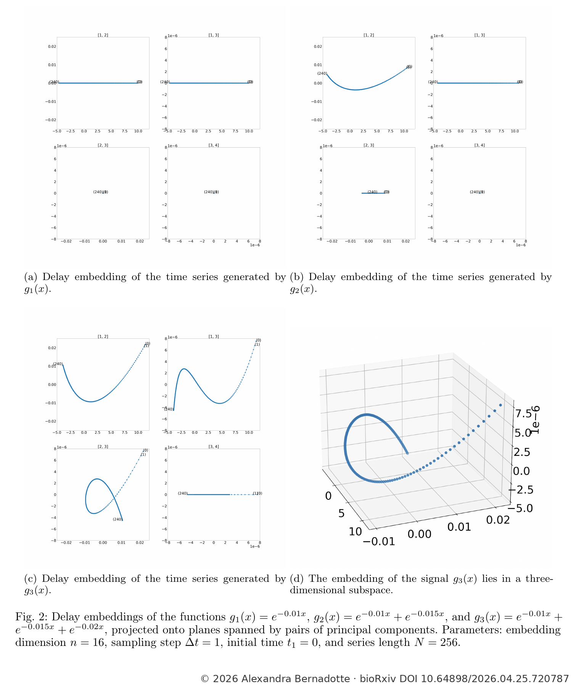
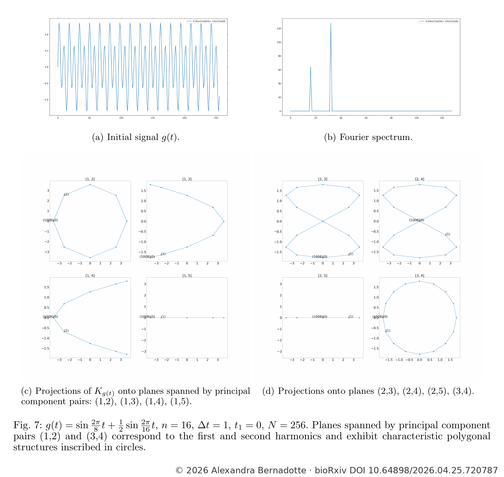
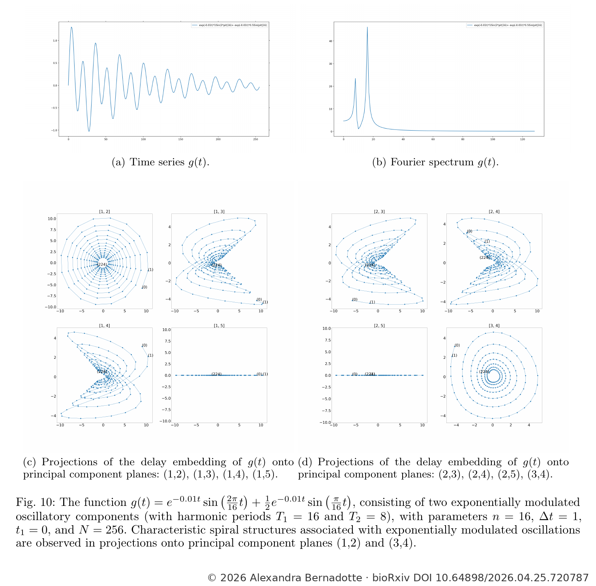
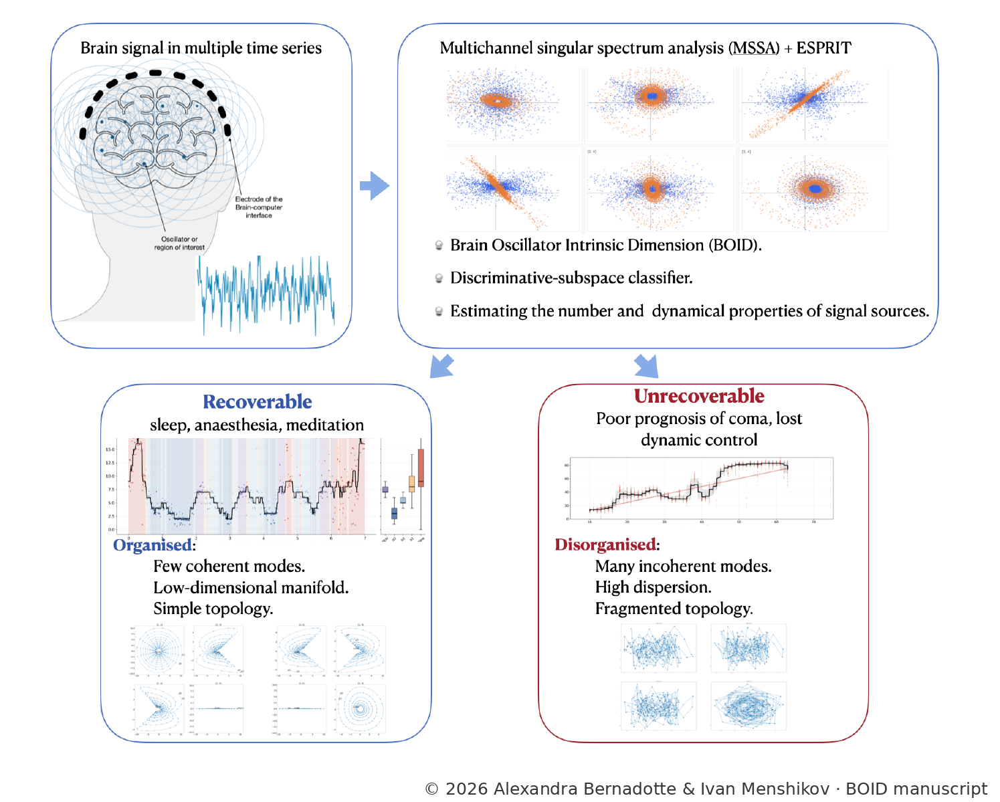
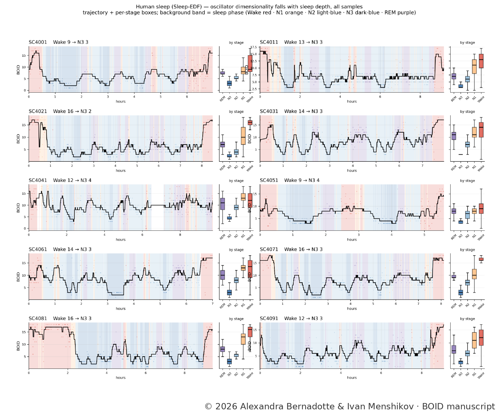

# BOID — Bernadotte Oscillator Intrinsic Dimension

**BOID (Bernadotte Oscillator Intrinsic Dimension)** is a general method for estimating the number and structure of active oscillatory modes in multichannel time series.

It combines a block-Hankel / multichannel singular-spectrum-analysis (MSSA) representation with statistically thresholded signal-subspace estimation and TLS-ESPRIT pole recovery. The accompanying neuroscience work applies BOID to sleep, anesthesia, meditation, and post-anoxic coma; in that application it has also been described as *Brain Oscillator Intrinsic Dimension*.

**Authors:** Alexandra Bernadotte and Ivan Menshikov, AiCumene  
**BOID preprint:** https://research.aicumene.com/papers/boid-coma/  
**DOI:** https://doi.org/10.13140/RG.2.2.31610.25288  
**MSSA core:** https://github.com/aicumene/MSSA  
**Companion dataset:** AiCumene EEG-BCI Sleep–Wake Dataset — https://doi.org/10.5281/zenodo.22923070  
**Dataset repository:** https://github.com/aicumene/aicumene-eeg-bci-sleep-wake-dataset  
**Theoretical foundation:** A. Bernadotte, *Topology-driven classification of time series*, bioRxiv (2026), https://doi.org/10.64898/2026.04.25.720787

## Formal definition

Let a multichannel time series be

**Equation (1)**

$$\mathbf{x}(t)\in\mathbb{R}^{C}$$

For an embedding length $L$ and delay $\Delta$, construct the block-Hankel trajectory matrix $H_X$. Its lagged scatter matrix is

**Equation (2)**

$$\Sigma_H=\frac{1}{M}H_XH_X^{\top}$$

The statistically significant MSSA signal subspace is selected from the eigenvalues of $\Sigma_H$ using a self-calibrated Marchenko–Pastur / Bai–Yin threshold,

**Equation (3)**

$$\hat r=\sum_{i=1}^{n} I(\lambda_i>\tau)$$

with

**Equation (4)**

$$\tau=\hat{\sigma}^{2}\left(1+\sqrt{n/M}\right)^{2}(1+c_n),\qquad \hat{\sigma}^{2}=\frac{\mathrm{median}(\lambda_1,\ldots,\lambda_n)}{m_{n/M}}$$

Here $I(\cdot)$ is the indicator function: it equals 1 when the stated condition is true and 0 otherwise.


TLS-ESPRIT is then applied to the retained signal subspace. If $z_k$ are the eigenvalues of the resulting shift operator, their frequencies are

**Equation (5)**

$$f_k=\frac{F_s}{2\pi\Delta}\arg(z_k)$$

**Bernadotte Oscillator Intrinsic Dimension (BOID)** is defined operationally as the number of resolved positive-frequency oscillatory modes retained inside the analysis band:

**Equation (6)**

$$\mathrm{BOID}(X)=\sum_k I(f_{\min}\le \frac{F_s}{2\pi\Delta}\arg(z_k)\le f_{\max})$$

For real-valued signals, oscillatory modes occur as complex-conjugate pole pairs, so only the positive-frequency member of each pair is counted.

Under the ideal finite-oscillator model, a signal containing $k_1$ aperiodic real-pole modes and $k_2$ oscillatory modes has block-Hankel rank

**Equation (7)**

$$r=k_1+2k_2$$

Thus, when $k_1=0$ and all oscillatory modes are resolved, $r=2m$ and $\mathrm{BOID}=m=r/2$. **This ideal rank relation is not the empirical definition of BOID**; in measured data BOID is defined by the retained positive-frequency TLS-ESPRIT poles.

The frequency band is application-specific. The associated neuroscience analyses use **1–40 Hz**; BOID itself is not restricted to neural signals or to this band.


## Theoretical foundation: the Bernadotte dimensionality law

The theoretical basis of BOID is the geometric invariance result introduced by
Alexandra Bernadotte in *Topology-driven classification of time series*
(bioRxiv, 2026; DOI: [10.64898/2026.04.25.720787](https://doi.org/10.64898/2026.04.25.720787)).
Theorem 1 and Eqs. (24)–(26) establish a direct relation between the generative
components of a structured time series and the dimension of its Hankel/delay
embedding.

For a signal composed of real exponential, harmonic, and exponentially modulated
oscillatory components,

**Equation (24)** — from *Topology-driven classification of time series* (source numbering)

$$g(t)=\sum_{i=1}^{k_1} a_i e^{\alpha_i t}+\sum_{j=1}^{k_2} b_j\sin(\omega_j t+\phi_j)+\sum_{\ell=1}^{k_3} c_\ell e^{\lambda_\ell t}\sin(\nu_\ell t+\psi_\ell)$$

with real, pairwise non-degenerate components, the associated delay-embedding
trajectory satisfies

**Equation (25)** — from *Topology-driven classification of time series* (source numbering)

$$K_{g(t)}\subset L$$

for a linear subspace $L$, whose dimension obeys

**Equation (26)** — from *Topology-driven classification of time series* (source numbering)

$$\dim L\le k_1+2k_2+2k_3$$

Under generic non-degeneracy conditions, equality holds. A real exponential
component contributes one independent direction, while each harmonic or
exponentially modulated oscillatory component contributes a two-dimensional
invariant plane associated with a complex-conjugate pair.

If

**Equation (8)**

$$m_{\mathrm{osc}}=k_2+k_3$$

then, under the generic ideal finite-component model,

**Equation (9)**

$$\dim L=k_1+2m_{\mathrm{osc}}$$

and therefore

**Equation (10)**

$$m_{\mathrm{osc}}=\frac{\dim L-k_1}{2}$$

We refer to this component-to-dimension relation here as the **Bernadotte
dimensionality law**. It provides the theoretical reason that oscillator count
is encoded in Hankel-subspace dimension.

<p align="center">
  
</p>

*Geometric foundation.* Delay embeddings generated by increasing numbers of structured components
occupy subspaces of increasing intrinsic dimension.  
**Source / author:** Alexandra Bernadotte, *Topology-driven classification of time series*,
Fig. 2, bioRxiv (2026), DOI: 10.64898/2026.04.25.720787.  
**Figure © Alexandra Bernadotte.**


The theorem is formulated for a structured scalar time series. BOID uses its
multichannel block-Hankel/MSSA extension: the statistically significant signal
subspace is estimated first, and TLS-ESPRIT then resolves the oscillatory poles
inside that subspace.

**The dimensionality law is not the empirical definition of BOID.** In measured
data, BOID remains defined operationally as the number of retained
positive-frequency TLS-ESPRIT poles inside the chosen analysis band. This
distinction allows real-pole components, unresolved modes, noise, and
application-specific frequency restrictions to be handled explicitly.


## Why oscillator dimensionality matters

BOID is not intended as another generic complexity score. Its purpose is to
estimate a structural quantity with a direct dynamical interpretation: the
number of **active oscillatory degrees of freedom** that are resolved in a
system at a given time.

This is different from spectral power, spectral entropy, or sequence-complexity
measures. Spectral power describes where signal energy is concentrated;
entropy describes how broadly that energy or uncertainty is distributed; and
sequence-complexity measures describe irregularity. BOID asks a different
question:

> **How many dynamically independent oscillatory modes are active?**

The reason this quantity is meaningful is geometric. In the structured
finite-component setting, the delay/Hankel embedding is confined to a
low-dimensional invariant subspace whose dimension is determined by the number
and type of the latent dynamical components. Real exponential components
contribute one direction, while oscillatory components contribute
two-dimensional invariant planes associated with complex-conjugate pole pairs.
This is the component-to-dimension relation formalized in the Bernadotte
geometric-invariance theorem.

BOID isolates the oscillatory part of that structure. Rather than equating
oscillator count with half of the estimated rank in empirical data, it resolves
the statistically significant MSSA signal subspace with TLS-ESPRIT and counts
the retained positive-frequency poles in the analysis band.

<p align="center">
  
</p>

*Why oscillators contribute dimensionality.* Harmonic components generate characteristic
two-dimensional structures in delay-embedding space; multiple oscillatory components combine into
a higher-dimensional oscillator repertoire.  
**Source / author:** Alexandra Bernadotte, *Topology-driven classification of time series*,
Fig. 7, bioRxiv (2026), DOI: 10.64898/2026.04.25.720787.  
**Figure © Alexandra Bernadotte.**


The central idea is therefore not that a healthy or well-organized system should
maximize dimensionality. What matters is whether the system can **regulate its
oscillator repertoire**:

> **Dynamical organization ≠ maximum complexity.**
>
> More specifically, dynamical organization is expressed through the **controlled expansion, contraction, and coordination of active oscillatory degrees of freedom**.

In neuroscience this distinction is essential. The same low BOID can accompany
deep sleep, anesthesia, or trained low-dimensional waking states, while a high
BOID after severe injury can reflect pathological mode proliferation rather
than richer conscious dynamics. BOID should therefore be interpreted together
with the organization of the underlying signal subspace and with
application-specific context.

More generally, BOID provides a way to describe structured dynamical systems in
terms of the size of their active oscillator repertoire. Whenever a process can
be approximated by a finite set of oscillatory or exponentially modulated
oscillatory modes, oscillator dimensionality becomes a candidate structural
observable of the system's dynamical organization.

<p align="center">
  
</p>

*Beyond pure harmonics.* Exponentially modulated oscillations retain structured,
low-dimensional geometry while encoding growth or decay together with rotation.  
**Source / author:** Alexandra Bernadotte, *Topology-driven classification of time series*,
Fig. 10, bioRxiv (2026), DOI: 10.64898/2026.04.25.720787.  
**Figure © Alexandra Bernadotte.**


## Method pipeline

```text
multichannel time series
        ↓
block-Hankel embedding
        ↓
MSSA signal subspace
        ↓
MP / Bai–Yin ε-rank
        ↓
TLS-ESPRIT poles
        ↓
retain positive-frequency poles in [fmin, fmax]
        ↓
BOID
```

BOID measures the size of the resolved oscillator repertoire. It is distinct from spectral power, spectral entropy, or sequence-complexity measures: those quantify how energy or irregularity is distributed, whereas BOID counts resolved oscillatory degrees of freedom.

## MSSA dependency

The generic block-Hankel, MSSA, reconstruction, and rank-estimation layer is maintained separately:

https://github.com/aicumene/MSSA

Associated preprint:

> Alexandra Bernadotte, Ivan Menshikov. **Multichannel Singular Spectrum Analysis.** AiCumene. Preprint. 2026.  
> https://research.aicumene.com/papers/MSSA/

BOID depends on the separate MSSA package at `https://github.com/aicumene/MSSA` and does not duplicate the generic Hankel/MSSA/rank implementation.

## Repository structure

The generic Hankel/MSSA/rank layer is **not duplicated here**; it belongs to
[`aicumene/MSSA`](https://github.com/aicumene/MSSA).

```text
aicumene/MSSA
    block-Hankel
    MSSA
    MP / Bai–Yin rank estimation
    signal-subspace extraction
          ↓
aicumene/BOID
    TLS-ESPRIT
    pole filtering
    BOID estimator
    oscillator descriptors
    regulated-dimensionality analysis
    neuroscience applications
```

The Python package mirrors that boundary:

```text
src/boid/
├── esprit.py                 TLS-ESPRIT shift-operator estimation
├── poles.py                  pole frequency/damping conversion and filtering
├── estimator.py              Bernadotte Oscillator Intrinsic Dimension estimator
├── descriptors.py            oscillator-family descriptors
├── regulation.py             state-dependent dimensionality summaries
├── theory.py                 Bernadotte dimensionality law (Eqs. 24–26)
├── geometry.py               signal-subspace / Grassmannian geometry
├── preprocessing.py          general signal preprocessing helpers
├── applications/
│   ├── neuroscience.py       neuroscience-specific BOID conventions
│   └── sleep.py              EEG/PSG sleep workflow
└── research/
    ├── complexity.py
    ├── intrinsic_dimension.py
    ├── topology.py
    ├── subspace_classifier.py
    ├── statistics.py
    └── synthetic.py
```

Figure provenance and source mapping: [`figures/SOURCES.md`](figures/SOURCES.md)

## Installation

```bash
git clone https://github.com/aicumene/BOID
cd BOID
pip install -e .
```

`pip` will install the MSSA dependency from `https://github.com/aicumene/MSSA.git`. Until that repository is published, use a local checkout of the MSSA package when developing BOID.

Optional application dependencies:

```bash
pip install -e ".[analysis]"       # pandas + scikit-learn
pip install -e ".[neuroscience]"   # pandas + MNE
```

Optional topology dependencies:

```bash
pip install -e ".[topology]"
```

## Minimal usage

```python
from boid import estimate_boid

result = estimate_boid(
    X,                              # channels × samples
    fs=100.0,
    embedding_lag=FINAL_L,
    finite_sample_correction=FINAL_C_N,
    delay_samples=1,
    fmin=1.0,
    fmax=40.0,
)

print(result.boid)
print(result.frequencies_hz)
```

`embedding_lag` and the finite-sample correction are exposed explicitly rather than silently hard-coded. The final article-level values should be fixed in the release configuration once the manuscript specification is final.

## Neuroscience application

The accompanying study uses BOID as a state-regime marker rather than as a monotonic “more is better” complexity score.

<p align="center">
  
</p>

*Neuroscience application.* This manuscript figure uses the brain-specific expansion
“Brain Oscillator Intrinsic Dimension”; the general method name in this repository is
**Bernadotte Oscillator Intrinsic Dimension**. The key distinction is between regulated
low-dimensional states and pathological loss of dynamical control.  
**Source / authors:** Alexandra Bernadotte & Ivan Menshikov, *Brain states are organized by
regulated oscillator dimensionality*, Fig. 1, manuscript (2026).  
**Figure © Alexandra Bernadotte and Ivan Menshikov.**


- **Sleep:** oscillator dimensionality decreases from wakefulness toward deep NREM sleep, with REM occupying an intermediate regime.
- **Propofol anesthesia:** dimensionality decreases despite structured spectral activity.
- **Meditation:** lower oscillator dimensionality can coexist with preserved waking control.
- **Post-anoxic coma:** higher BOID can reflect pathological mode proliferation rather than richer consciousness; retrospective outcome associations remain withdrawal-confounded.

These neuroscience interpretations are application-specific and should not be generalized to arbitrary time-series domains without validation.

<p align="center">
  
</p>

*Representative neural-state application.* Whole-night Sleep-EDF trajectories show a regulated
contraction of the oscillator repertoire with sleep depth, with the lowest dimensionality in N3 and
an intermediate regime in REM.  
**Source / authors:** Alexandra Bernadotte & Ivan Menshikov, *Brain states are organized by
regulated oscillator dimensionality*, Fig. S1, manuscript (2026).  
**Figure © Alexandra Bernadotte and Ivan Menshikov.**


## How BOID connects to the AiCumene EEG-BCI Sleep–Wake Dataset

**The dataset does not define BOID; it tests BOID.** BOID is a general dynamical
estimator. The companion dataset provides a neuroscience validation environment
for testing state-dependent regulation of oscillator dimensionality.

The **AiCumene EEG-BCI Sleep–Wake Dataset** is archived on Zenodo:

> **DOI:** https://doi.org/10.5281/zenodo.22923070

The dataset consists of two components:

1. **Synthetic-data component** — a public component for reproducible validation,
   testing, and demonstration of the BOID/MSSA analysis workflow.
2. **AiCumene-device recordings** — real sleep/wake electrophysiological recordings
   acquired with AiCumene neurointerface devices. These recordings are available
   to qualified researchers **upon request**, subject to the applicable access,
   privacy, and data-use conditions.

The companion dataset repository is available at:

https://github.com/aicumene/aicumene-eeg-bci-sleep-wake-dataset

The relationship between the dataset and the software is:

```text
AiCumene EEG-BCI Sleep–Wake Dataset
        │
        ├── synthetic validation data
        │
        └── AiCumene-device recordings (upon request)
        ↓
BOID neuroscience / sleep application layer
        ↓
preprocessing and windowing
        ↓
aicumene/MSSA
(block-Hankel → MSSA → MP / Bai–Yin signal subspace)
        ↓
aicumene/BOID
(TLS-ESPRIT → pole filtering → BOID estimator)
        ↓
window-level BOID
        ↓
sleep-stage aggregation
        ↓
regulated oscillator dimensionality
across Wake / N1 / N2 / N3 / REM
```

Dataset-specific loaders, labels, access rules, and sleep-stage aggregation belong
to the application layer. The mathematical BOID core remains dataset-agnostic.

Data and software are therefore maintained as separate research objects: Zenodo is
the archival record for the dataset, the companion dataset repository documents
dataset structure and access, and this repository contains the BOID method and
analysis code.

## Theoretical lineage and related work

### Primary BOID work

- **Bernadotte, A.; Menshikov, I.** *Brain Oscillator Intrinsic Dimension marks consciousness, recovery mode, and failed downshifting in coma.* AiCumene. Preprint. 2026. DOI: https://doi.org/10.13140/RG.2.2.31610.25288

### Theoretical foundation

- **Bernadotte, A.** *Topology-driven classification of time series.* bioRxiv, 2026. DOI: https://doi.org/10.64898/2026.04.25.720787  
  **Theorem 1, Eqs. (24)–(26)** establish the component-to-dimension law underlying BOID: structured exponential and oscillatory components generate invariant low-dimensional Hankel subspaces whose dimension is determined by the number and type of latent dynamical modes.

### MSSA mathematical layer

- **Bernadotte, A.; Menshikov, I.** *Multichannel Singular Spectrum Analysis.* AiCumene. Preprint. 2026. https://research.aicumene.com/papers/MSSA/

### Foundational precursor

- **Bernadotte, A.; Buchstaber, V.** *Method for evaluating the number of signal sources and application to non-invasive brain-computer interface.* arXiv:2410.11844 (2024). DOI: https://doi.org/10.48550/arXiv.2410.11844.  
  Develops the Hankel-embedding/source-counting line that precedes the BOID formulation.

### Applied / engineering continuation

- **Bernadotte, A.** *Estimating the Number of Sources in EEG with Hankel Embedding for Brain-Computer Interface.* ICARA 2026. DOI: https://doi.org/10.1109/ICARA69401.2026.11480398
- **Menshikov, I.; Elfimov, N.; Bernadotte, A.** *A Lightweight Hankel-Embedded Pipeline for Real-Time EEG Filtering and Classification.* ICARA 2026. DOI: https://doi.org/10.1109/ICARA69401.2026.11480292

### Foundational methods

- **Golyandina, N.; Nekrutkin, V.; Zhigljavsky, A.** *Analysis of Time Series Structure: SSA and Related Techniques.* Chapman & Hall/CRC (2001).
- **Golyandina, N.; Zhigljavsky, A.** *Singular Spectrum Analysis for Time Series.* Springer Briefs in Statistics (2013; 2nd ed. 2020).
- **Buchstaber, V. M.** *Time series analysis and Grassmannians.* Amer. Math. Soc. Transl. 162, 1–17 (1994).
- **Roy, R.; Kailath, T.** *ESPRIT — estimation of signal parameters via rotational invariance techniques.* IEEE Trans. ASSP 37, 984–995 (1989). DOI: https://doi.org/10.1109/29.32276

## Citation

Please cite the BOID preprint:

> **Bernadotte, A. & Menshikov, I. (2026).** *Brain Oscillator Intrinsic Dimension marks consciousness, recovery mode, and failed downshifting in coma.* AiCumene. Preprint. DOI: 10.13140/RG.2.2.31610.25288.  
> https://research.aicumene.com/papers/boid-coma/

A peer-reviewed manuscript, *Brain states are organized by regulated oscillator dimensionality*, is in preparation / submission. Its final journal citation and DOI should replace the manuscript placeholder after publication.

See [`CITATION.cff`](CITATION.cff) for machine-readable citation metadata.

## License

BOID is licensed under the **PolyForm Noncommercial License 1.0.0** (`PolyForm-Noncommercial-1.0.0`). Noncommercial use, modification, and distribution are permitted under the terms of that license. Commercial use requires a separate license or permission from the rights holders.

Official terms: https://polyformproject.org/licenses/noncommercial/1.0.0

Copyright © 2026 Alexandra Bernadotte and Ivan Menshikov, AiCumene.
